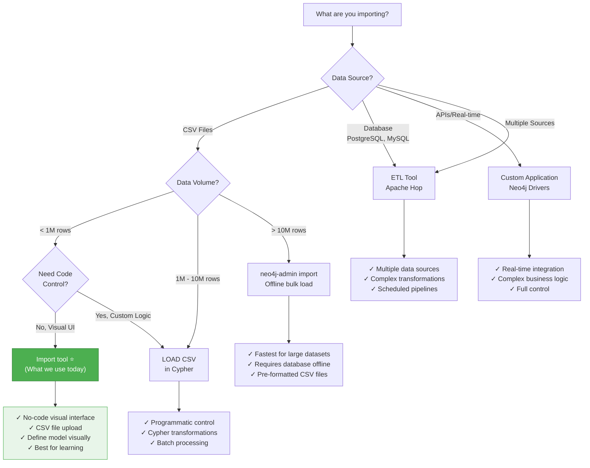

# Workshop-Modeling: Final Streamlined Structure

**Target Duration:** 106 minutes workshop + 14 minutes buffer = 120 minutes total
**Last Updated:** February 14, 2026

---

## Design Principles

1. **Platform-provisioned instances** - No Aura setup, credentials provided
2. **Focused tools** - Only show Query and Import tool
3. **Reduced cognitive load** - One concept per lesson, unified comparisons
4. **Factual performance explanations** - Anchor nodes + traversal (no salesy claims)
5. **Early wow moment** - Recommendation query at 60 minutes
6. **Clear progression** - Concepts → Single practice → Complete model → Query

---

## MODULE 1: Setup & Introduction (13 minutes)

### Lesson 1.1: Workshop Overview & Goal (5 min)

**Type:** Lesson

**Content:**

- **Business question:** "What products do people like me buy, that I haven't bought yet?"
- **Preview the end result:** Show completed recommendation query and sample results
- **Dataset overview:** Northwind (91 customers, 830 orders, 77 products, 8 categories)
- **Learning path:** Model → Import → Query
- **Connection credentials:**

  ```
  You have a Neo4j instance provisioned for this workshop.

  Connection URL: bolt://[provided]
  Username: [provided]
  Password: [provided]

  console::Open Neo4j Query[tool=query]
  ```

**Key message:** "By the end, you'll build a working recommendation engine and understand why graphs excel at this."

---

### Lesson 1.2: Quick Tools Tour (3 min)

**Type:** Lesson

**Content:**

- **Neo4j Workspace overview:**
  - **Query:** Where you write and run Cypher queries (we'll use this to verify imports)
  - **Import:** Where you design models and import data (we'll spend most time here)
- **That's it!** Two tools, clear purposes
- console::Open Import Tool[tool=import]

**Cognitive load:** Only show tools students will actually use

---

### Lesson 1.3: Using the Import Tool & Ecosystem (5 min)

**Type:** Lesson

**Content:**

**Import Tool Workflow:**

1. **Data Sources:** Upload CSV files or connect to databases
2. **Graph Models:** Design nodes and relationships visually
3. **Import Jobs:** Run imports and see results

**Import Options Ecosystem:**



**Key message:** "Today we use Import tool because we have CSV files < 1M rows and want visual learning. Other tools exist for larger datasets or different sources."

---

## MODULE 2: Graph Modeling & First Import (37 minutes)

### Lesson 2.1: Graph Elements & Performance (9 min)

**Type:** Lesson

**Content:**

**Part A: The Four Building Blocks (4 min)**

- **Nodes:** Entities (nouns) - Customer, Product, Order
- **Labels:** Categories of nodes - `:Customer`, `:Product`
- **Relationships:** Connections (verbs) - `[:PLACED]`, `[:CONTAINS]`
- **Properties:** Attributes - `{name: "Alice", price: 29.99}`

**Cypher Pattern Syntax:**

```cypher
// Node pattern
(c:Customer)

// Relationship pattern
(c:Customer)-[:PLACED]->(o:Order)

// With properties
(c:Customer {name: "Alice"})-[:PLACED]->(o:Order)
```

**Part B: How Queries Work - Anchor Nodes & Traversal (5 min)**

**The Performance Model:**

```
Step 1: Find anchor node (starting point)
├─ Without index: Scan all nodes → O(n)
└─ With index: Direct lookup → O(1)

Step 2: Traverse relationships
└─ Follow relationship pointers → O(k) where k = number of connections
```

**Example:**

```cypher
MATCH (c:Customer {id: 'ALFKI'}) // <1> Find customer ALFKI (anchor node - uses index)
      -[:PLACED]->(o:Order)     // <2> Traverse to orders (follow pointers)
      -[:CONTAINS]->(p:Product) // <3> Traverse to products (follow pointers)
RETURN p.name
```

**Why graphs perform well:**

- Index finds anchor in constant time
- Relationships are pre-materialized pointers (not computed JOINs)
- Query cost scales with connections (O(k)), not table size (O(n))
- Relational databases must scan tables and compute joins repeatedly

**Constraints & Indexes:**

- **Constraint:** Ensures uniqueness (no duplicate customer IDs)
- **Index:** Enables fast lookups (finding anchor nodes)
- When we set "unique identifier" in Import tool, it creates both automatically

**Key message:** "Indexes find starting points fast, then you follow relationship pointers. This is the factual reason graphs excel at connected data queries."

---

### Lesson 2.2: Modeling Decisions (10 min)

**Type:** Lesson

**Content:**

**Identifying Nodes Quick Criteria:**

- Is it a distinct entity? → Node
- Does it have its own properties? → Node
- Do you need to query it directly? → Node
- Does it connect other entities? → Node

**The Modeling Decision: One Side-by-Side Comparison**

**Scenario:** Customers purchase products

```
┌─────────────────────────────────────────────────────────────────┐
│ Option A: Relationship with Properties                          │
│                                                                  │
│  (:Customer)-[:PURCHASED {quantity: 5,                          │
│                           price: 49.99,                          │
│                           date: '2024-01-15'}]->(:Product)       │
│                                                                  │
│  ✓ Simple structure (fewer nodes)                               │
│  ✓ Direct connection                                            │
│  ✗ Can't query purchases independently                          │
│  ✗ Searching on relationship properties is EXPENSIVE            │
│  ✗ One product per purchase (no order with multiple items)      │
└─────────────────────────────────────────────────────────────────┘

┌─────────────────────────────────────────────────────────────────┐
│ Option B: Intermediate Node                                     │
│                                                                  │
│  (:Customer)-[:PLACED]->(:Order {date: '2024-01-15',           │
│                                  shipCountry: 'USA'})            │
│             -[:CONTAINS {quantity: 5,                           │
│                         unitPrice: 9.99}]->(:Product)           │
│                                                                  │
│  ✓ Can query orders directly: MATCH (o:Order) WHERE...         │
│  ✓ Can filter efficiently on Order.date (indexed property)      │
│  ✓ Multiple products per order supported                        │
│  ✓ Order can have its own properties (shipCountry, status)      │
│  ✗ More complex structure                                       │
└─────────────────────────────────────────────────────────────────┘
```

**The Key Rule:**

```
┌────────────────────────────────────────────────────┐
│  If you need to search/filter on it → Make it a   │
│  NODE (not a relationship property)                │
│                                                     │
│  Why? Accessing relationship properties requires   │
│  scanning relationships. Node properties can be    │
│  indexed for O(1) lookup.                          │
└────────────────────────────────────────────────────┘
```

**Decision Framework:**

- **Simple attribute?** → Property on node (`customer.name`)
- **Need to search/filter?** → Property on node + create index
- **Connection attribute?** → Property on relationship (quantity on CONTAINS)
- **BUT: Need to search connection attribute?** → Promote to intermediate node
- **Shared entity?** → Separate node (Category shared by many Products)

**Our Northwind Model Uses Option B:**

- Orders need their own properties (date, shipCountry)
- We want to query orders directly ("show all orders from January")
- Orders connect customers to multiple products
- We can filter efficiently on Order.date

**Key message:** "One decision rule: If you need to search on it, make it a node. Relationship properties work for simple attributes, but searching them is expensive."

---

### Lesson 2.3: Hands-On - Import First Connection (20 min)

**Type:** Challenge

**Goal:** Build the Customer → Order connection to learn the complete import workflow

console::Open Import Tool[tool=import]

**Step 1: Import Customer Nodes (8 min)**

1. **Upload Data Source:**
   - Download `customers.csv`
   - Upload to Import tool Data Sources tab
   - Preview data

2. **Create Customer Node:**
   - Go to Graph Models tab
   - Add new node label: `Customer`
   - Map CSV columns to properties:
     - `customerID` → `id` (rename for clarity)
     - `companyName` → `name` (rename for clarity)
     - `country` → `country`
     - `city` → `city`
     - `contactName` → `contactName`

3. **Set Unique Identifier:**
   - Select `id` as unique identifier
   - **Notice:** This creates a constraint AND index automatically
   - **Callback:** "Remember anchor nodes? This index lets queries find customers in O(1) time"

4. **Preview & Import:**
   - Preview model
   - Run import
   - **Expected:** 91 Customer nodes created

5. **Verify:**
   console::Open Query[tool=query]
   ```cypher
   MATCH (c:Customer)
   RETURN c.name, c.country, c.city
   LIMIT 5
   ```

---

**Step 2: Import Order Nodes (5 min)**

1. **Upload Data Source:**
   - Upload `orders.csv`

2. **Create Order Node:**
   - Add node label: `Order`
   - Map properties:
     - `orderID` → `id`
     - `orderDate` → `date`
     - `shipCountry` → `shipCountry`
     - `shipCity` → `shipCity`

3. **Set Unique Identifier:**
   - Select `id` as unique identifier

4. **Import:**
   - Run import
   - **Expected:** 830 Order nodes created

5. **Verify:**
   ```cypher
   MATCH (o:Order)
   RETURN o.id, o.date, o.shipCountry
   LIMIT 5
   ```

---

**Step 3: Create PLACED Relationship (7 min)**

1. **Add Relationship:**
   - In Graph Models, drag from Customer to Order
   - Relationship type: `PLACED`
   - Direction: Customer → Order

2. **Map Relationship:**
   - Select data source: `orders.csv`
   - Map source node: `customerID` → `Customer.id`
   - Map target node: `orderID` → `Order.id`

3. **Add Relationship Properties (optional):**
   - Map `orderDate` → property on relationship (demonstrates relationship properties)
   - Map `shipCountry` → property on relationship

4. **Import:**
   - Run import
   - **Expected:** 830 PLACED relationships created

5. **Verify Pattern:**
   ```cypher
   MATCH (c:Customer)-[r:PLACED]->(o:Order)
   RETURN c.name, o.id, o.date
   LIMIT 5
   ```

**Checkpoint:** Students now understand the complete cycle: Nodes → Relationship → Verification

---

## MODULE 3: Complete Import & Recommendation Query (47 minutes)

### Lesson 3.1: Many-to-Many Relationships (14 min)

**Type:** Lesson

**Content:**

**Part A: The Relational Problem (5 min)**

**Many-to-Many in SQL:**

```
Customers ↔ Products (many-to-many)

Requires junction/pivot table:
├─ customers table
├─ products table
├─ orders table (junction)
└─ order_details table (junction with properties)

Query requires multiple JOINs:
SELECT p.productName
FROM customers c
JOIN orders o ON c.customerID = o.customerID
JOIN order_details od ON o.orderID = od.orderID
JOIN products p ON od.productID = p.productID
WHERE c.customerID = 'ALFKI'
```

**Part B: The Graph Solution (5 min)**

**Direct Relationships:**

```
Customer → Order → Product

No junction table needed - relationships ARE the connections:
├─ Customer -[:PLACED]-> Order (we already have this!)
├─ Order -[:CONTAINS]-> Product (we'll create this)
└─ Product -[:IN_CATEGORY]-> Category (optional enrichment)

Query is a pattern:
MATCH (c:Customer {id: 'ALFKI'})
      -[:PLACED]->(o:Order)
      -[:CONTAINS]->(p:Product)
RETURN p.name
```

**Transformation:**

```
Junction table columns become relationship properties:

order_details table:
├─ orderID (foreign key) → Source node mapping
├─ productID (foreign key) → Target node mapping
├─ quantity → Property on CONTAINS relationship
└─ unitPrice → Property on CONTAINS relationship

Result:
(Order)-[:CONTAINS {quantity: 5, unitPrice: 9.99}]->(Product)
```

**Part C: Relationship Properties Performance Caveat (4 min)**

**When to use relationship properties:**

```
✓ Good: quantity, price, rating, timestamp
  - Attributes of THIS specific connection
  - Read when you have the relationship
  - Example: "How many of this product in this order?"

✗ Expensive: Using them for search/filter
  - "Find all orders with quantity > 10"
  - Requires scanning ALL relationships
  - No index possible on relationship properties in standard Neo4j
```

**The Rule (callback to Lesson 2.2):**

```
If you need to search/filter → Make it a NODE property, not relationship

Example:
├─ Bad: -[:CONTAINS {date: '2024-01-15'}]->
│   Filtering by date requires scanning all CONTAINS relationships
│
└─ Good: -[:PLACED]->(:Order {date: '2024-01-15'})-[:CONTAINS]->
    Filtering by date uses Order index (O(1) lookup)
```

**Why our model works:**

- `quantity` and `unitPrice` on CONTAINS: We only read these when we have the relationship
- `date` on Order: We filter/search on dates, so it's a node property with an index

**Key message:** "Junction tables become direct relationships. Properties work for simple attributes, but if you search on it, promote to a node."

---

### Lesson 3.2: Import Complete Model (18 min)

**Type:** Challenge

**Goal:** Complete the Northwind graph with Products, Categories, and remaining relationships

console::Open Import Tool[tool=import]

**Part A: Import Product & Category Nodes (8 min)**

1. **Upload Data Sources:**
   - Upload `products.csv`
   - Upload `categories.csv`

2. **Create Product Node:**
   - Label: `Product`
   - Map properties:
     - `productID` → `id`
     - `productName` → `name`
     - `unitPrice` → `unitPrice`
     - `unitsInStock` → `unitsInStock`
     - `discontinued` → `discontinued`
   - Set `id` as unique identifier

3. **Create Category Node:**
   - Label: `Category`
   - Map properties:
     - `categoryID` → `id`
     - `categoryName` → `name`
     - `description` → `description`
   - Set `id` as unique identifier

4. **Run Imports:**
   - **Expected:** 77 Products + 8 Categories

5. **Verify:**

   ```cypher
   MATCH (p:Product)
   RETURN p.name, p.unitPrice
   LIMIT 5

   MATCH (c:Category)
   RETURN c.name, c.description
   ```

---

**Part B: Create CONTAINS Relationship (5 min)**

**The Many-to-Many Transformation:**

1. **Add Relationship:**
   - Order → Product
   - Type: `CONTAINS`

2. **Map Relationship:**
   - Data source: `order-details.csv`
   - Source: `orderID` → `Order.id`
   - Target: `productID` → `Product.id`

3. **Add Relationship Properties:**
   - Map `quantity` → relationship property
   - Map `unitPrice` → relationship property
   - **Note:** "These properties describe THIS order's purchase of THIS product"

4. **Import:**
   - **Expected:** 2,155 CONTAINS relationships

5. **Verify:**
   ```cypher
   MATCH (o:Order)-[r:CONTAINS]->(p:Product)
   RETURN o.id, p.name, r.quantity, r.unitPrice
   LIMIT 5
   ```

---

**Part C: Create IN_CATEGORY Relationship (5 min)**

1. **Add Relationship:**
   - Product → Category
   - Type: `IN_CATEGORY`

2. **Map Relationship:**
   - Data source: `products.csv`
   - Source: `productID` → `Product.id`
   - Target: `categoryID` → `Category.id`

3. **Import:**
   - **Expected:** 77 IN_CATEGORY relationships

4. **Verify Complete Pattern:**
   ```cypher
   MATCH (c:Customer)-[:PLACED]->(o:Order)
         -[:CONTAINS]->(p:Product)
         -[:IN_CATEGORY]->(cat:Category)
   RETURN c.name, p.name, cat.name
   LIMIT 10
   ```

**Checkpoint:** Complete graph model imported! Customer → Order → Product → Category all connected.

---

### Lesson 3.3: Build the Recommendation Query (15 min)

**Type:** Lesson

**The Wow Moment - Collaborative Filtering**

console::Open Query[tool=query]

**Setup (1 min):**
"Let's build a product recommendation query for customer ALFKI using collaborative filtering - the same technique Amazon and Netflix use."

**Algorithm:** Find products that similar customers bought, that I haven't bought yet.

---

**Step 1: Find My Products (3 min)**

```cypher
MATCH (me:Customer {id: 'ALFKI'})
      -[:PLACED]->(:Order)
      -[:CONTAINS]->(myProducts:Product)
RETURN myProducts.name
```

**Explain:**

- Start at anchor node (Customer ALFKI - index lookup)
- Traverse PLACED relationships (follow pointers)
- Traverse CONTAINS relationships (follow pointers)
- Collect products I've purchased

**Run query, show results**

---

**Step 2: Find Similar Customers (3 min)**

```cypher
MATCH (me:Customer {id: 'ALFKI'})
      -[:PLACED]->(:Order)
      -[:CONTAINS]->(myProducts:Product)
      <-[:CONTAINS]-(:Order)
      <-[:PLACED]-(similarCustomers:Customer)
WHERE similarCustomers <> me
RETURN similarCustomers.name,
       COUNT(DISTINCT myProducts) AS productsInCommon
ORDER BY productsInCommon DESC
LIMIT 10
```

**Explain:**

- Same pattern, but then traverse BACKWARDS
- Find other customers who bought my products
- Count shared products (more shared = more similar)
- This is the "collaborative" part - finding similar users

**Run query, show results**

---

**Step 3: Find Their Products That I Don't Have (5 min)**

```cypher
MATCH (me:Customer {id: 'ALFKI'})
      -[:PLACED]->(:Order)
      -[:CONTAINS]->(myProducts:Product)
      <-[:CONTAINS]-(:Order)
      <-[:PLACED]-(similarCustomers:Customer)
      -[:PLACED]->(:Order)
      -[:CONTAINS]->(recommendations:Product)
WHERE recommendations <> myProducts
  AND recommendations.discontinued = false
RETURN recommendations.name AS product,
       COUNT(DISTINCT similarCustomers) AS recommendedBy,
       recommendations.unitPrice AS price
ORDER BY recommendedBy DESC, price ASC
LIMIT 10
```

**Explain:**

- Continue the pattern: similar customers → their orders → their products
- Filter out products I already have (`WHERE recommendations <> myProducts`)
- Add business rules: not discontinued
- Rank by popularity (how many similar customers bought it)
- Secondary sort by price (cheaper first)

**Run query - THIS IS THE WOW MOMENT**

**Show results:** "These are the top 10 product recommendations for customer ALFKI!"

---

**Step 4: Performance Discussion (3 min)**

**Why this works:**

```
Graph approach:
├─ Find anchor: O(1) with index
├─ Traverse PLACED: O(k₁) where k₁ = orders per customer
├─ Traverse CONTAINS: O(k₂) where k₂ = products per order
├─ Traverse back: O(k₃) where k₃ = other orders with same products
└─ Total: O(k) - scales with connections

Query cost is proportional to:
- How many orders the customer has
- How many products per order
- How many similar customers
NOT the total size of tables

Relational approach:
├─ Scan customers table
├─ JOIN with orders (all orders)
├─ JOIN with order_details (all order items)
├─ JOIN back to find other customers
├─ JOIN to get their products
└─ Total: O(n × m) - scales with table sizes
```

**Key insight:** "The graph query only touches relevant data. SQL must scan entire tables and compute joins. This is why graphs excel at connected data queries - it's about the algorithm, not magic."

---

## MODULE 4: Wrap-Up & Assessment (9 minutes)

### Lesson 4.1: Quick Recap (2 min)

**Type:** Lesson

**What You Learned:**

- ✓ Graph elements: Nodes, relationships, properties, labels
- ✓ Performance model: Anchor nodes (indexed) + traversal (pointers)
- ✓ Modeling rule: Search on it? Make it a node
- ✓ Import tool: Create nodes, relationships, set constraints
- ✓ Many-to-many: Junction tables become direct relationships
- ✓ Cypher queries: Pattern matching for recommendations
- ✓ Why graphs perform well: Query cost scales with connections, not table size

**Next Steps:**

- GraphAcademy courses: "Cypher Fundamentals", "Graph Data Modeling Fundamentals"
- Import your own data: Apply same workflow (identify nodes → import → query)
- Explore more patterns: Social networks, fraud detection, knowledge graphs

---

### Lesson 4.2: Knowledge Check (7 min)

**Type:** Quiz

**10 Questions:**

1. **Which should be a node?**
   - a) Customer's favorite color
   - b) Product
   - c) Order date
   - d) Quantity ordered
   - **Answer:** b) Product

2. **What's the correct Cypher pattern for "Customers who placed orders"?**
   - a) `(c:Customer)<-[:PLACED]-(o:Order)`
   - b) `(c:Customer)-[:PLACED]->(o:Order)`
   - c) `[c:Customer]->(o:Order)`
   - d) `(c:Customer)[:PLACED](o:Order)`
   - **Answer:** b

3. **Where should `quantity` be stored in Order→Product connection?**
   - a) Property on Order node
   - b) Property on Product node
   - c) Property on CONTAINS relationship
   - d) Separate Quantity node
   - **Answer:** c

4. **Why are relationship properties expensive to search on?**
   - a) They can't be indexed in standard Neo4j
   - b) They require scanning all relationships
   - c) Both a and b
   - d) They're not expensive
   - **Answer:** c

5. **What does a unique identifier constraint provide?**
   - a) Prevents duplicate nodes
   - b) Creates an index automatically
   - c) Enables fast anchor node lookups
   - d) All of the above
   - **Answer:** d

6. **How do graph queries achieve good performance?**
   - a) Index finds anchor node in O(1)
   - b) Traverse relationships via pointers in O(k)
   - c) Query cost scales with connections, not table size
   - d) All of the above
   - **Answer:** d

7. **What does `WHERE NOT (customer)-[:PURCHASED]->(product)` do?**
   - a) Finds products the customer purchased
   - b) Filters out products the customer already purchased
   - c) Finds customers who didn't purchase
   - d) Deletes purchase relationships
   - **Answer:** b

8. **When should you make something a node instead of a relationship property?**
   - a) When you need to search/filter on it
   - b) When it has its own properties
   - c) When you need to query it directly
   - d) All of the above
   - **Answer:** d

9. **What happens to junction tables in graph models?**
   - a) They become intermediate nodes
   - b) They become direct relationships
   - c) They become properties
   - d) Depends on whether you need to query them
   - **Answer:** d (trick question - if you need to query them, they're nodes; if not, they're relationships)

10. **What is collaborative filtering?**
    - a) Finding products based on similar users' behavior
    - b) Filtering SQL JOIN results
    - c) A data quality technique
    - d) A constraint type
    - **Answer:** a

---

## STRETCH GOAL: For Fast Finishers

### Optional Conversation Lesson: Model Your Own Data

**Type:** Conversation
**Source:** `neo4j-fundamentals/modules/1-graph-thinking/lessons/4-build-data-model`
**Placement:** After Module 4 or as "Bonus" section

**Content:**
Claude-powered conversation to help students design a graph model for their own use case:

- Describe your data or problem
- Claude identifies nodes (nouns)
- Claude identifies relationships (verbs)
- Claude suggests properties
- Iterative refinement

**Use case:** Advanced students who finish early can start modeling their own data while others catch up.

---

## TIMING SUMMARY

| Module                                      | Time   | Cumulative  |
| ------------------------------------------- | ------ | ----------- |
| **Module 1: Setup & Introduction**          | 13 min | 13 min      |
| 1.1: Workshop Overview                      | 5 min  | 5 min       |
| 1.2: Quick Tools Tour                       | 3 min  | 8 min       |
| 1.3: Import Tool & Ecosystem                | 5 min  | 13 min      |
| **Module 2: Graph Modeling & First Import** | 37 min | 50 min      |
| 2.1: Graph Elements & Performance           | 9 min  | 22 min      |
| 2.2: Modeling Decisions                     | 10 min | 32 min      |
| 2.3: Hands-On Import                        | 20 min | 50 min      |
| **Module 3: Complete Import & Query**       | 47 min | 97 min      |
| 3.1: Many-to-Many                           | 14 min | 64 min      |
| 3.2: Complete Import                        | 18 min | 82 min      |
| 3.3: Recommendation Query                   | 15 min | 97 min      |
| **Module 4: Wrap-Up**                       | 9 min  | 106 min     |
| 4.1: Quick Recap                            | 2 min  | 99 min      |
| 4.2: Knowledge Check                        | 7 min  | 106 min     |
| **Buffer for Q&A**                          | 14 min | **120 min** |

---

## COGNITIVE LOAD REDUCTION STRATEGIES

### 1. Fewer Tools (Module 1.2)

- **Before:** Show all workspace tools (Query, Import, Explore, Bloom, Dashboards, Admin)
- **After:** Show only Query and Import
- **Impact:** Reduces decision fatigue, focuses attention

### 2. Unified Mental Model (Module 2.1)

- **Before:** Multiple index concepts (constraints, enforcement, MERGE, index types)
- **After:** One model (anchor → traverse)
- **Impact:** Single memorable concept instead of multiple technical details

### 3. Single Comparison (Module 2.2)

- **Before:** Separate discussions of "node vs property" then "relationship vs intermediate node"
- **After:** One side-by-side comparison with visual diagram
- **Impact:** Direct comparison makes decision rule obvious

### 4. No Late Complexity (Module 3)

- **Before:** "Experiment with the query" section at end
- **After:** Query works, move on
- **Impact:** Don't ask tired students to modify complex patterns

### 5. Clear Single Focus Per Lesson

- Each lesson teaches ONE main concept
- No lesson tries to cover 3+ unrelated topics
- **Impact:** Easier to follow, clearer takeaways

---

## INSTRUCTOR NOTES

### Pacing Checkpoints

**25 min mark:** Should be finishing Module 2.1 (Graph Elements)

- **If behind:** Speed up Module 1.2 (tools tour), it's just orientation
- **If ahead:** Add depth to anchor node examples

**50 min mark:** Should be finishing Module 2.3 (Hands-on import)

- **If behind:** Pre-load CSV files, have students follow along faster
- **If ahead:** Show additional verification queries

**97 min mark:** Should be finishing Module 3.3 (Recommendation query)

- **If behind:** Skip Step 4 (performance discussion), the query working is the wow moment
- **If ahead:** Show query variations (different customer, different filters)

### Common Student Questions

**Q: "Why is Order a node and not just a relationship?"**
A: Order has its own properties (date, shipCountry) that don't belong on Customer or Product. Plus we need to query orders directly: "Show all orders from January." If it were just a relationship, we couldn't do that.

**Q: "When do I use relationship properties vs. separate nodes?"**
A: Use relationship properties for attributes of the connection (quantity in THIS order). If you need to search/filter on it, or it has its own properties, make it a node. Rule: Search on it? Make it a node.

**Q: "What if my data is huge - millions of rows?"**
A: Import tool works up to ~1M rows. Above that: Use LOAD CSV in Cypher (1M-10M rows), or neo4j-admin import for bulk loads (10M+ rows). See the flowchart from Module 1.3.

**Q: "Do I always need unique IDs?"**
A: Yes, for nodes you'll connect via relationships. They create constraints (data quality) and indexes (performance). The import tool requires them for relationship mapping.

**Q: "Can I traverse relationships in both directions?"**
A: Yes! Cypher can traverse in either direction regardless of how relationships are stored. Both `(a)-[:KNOWS]->(b)` and `(b)<-[:KNOWS]-(a)` work on the same relationship.

### Technical Troubleshooting

**Import fails - "Node not found":**

- Check ID spelling in relationship mapping
- Verify unique IDs match between files
- Ensure nodes are imported before relationships

**Query returns no results:**

- Verify pattern direction matches model
- Check property names (case-sensitive)
- Use `RETURN count(*)` to verify nodes exist

**Performance seems slow:**

- Check if indexes created (SHOW INDEXES)
- Verify query uses indexed properties for anchor nodes
- Large result sets? Add LIMIT for testing

---

## SUCCESS METRICS

**Students should be able to:**

1. ✅ Explain when to use nodes vs. relationships vs. properties
2. ✅ Describe how indexes enable fast anchor node lookups
3. ✅ Use Import tool to create nodes and relationships
4. ✅ Transform many-to-many patterns (junction tables → direct relationships)
5. ✅ Write basic Cypher pattern matching queries
6. ✅ Write multi-hop traversals (2-3 hops)
7. ✅ Explain why relationship properties are expensive to search on
8. ✅ Build a collaborative filtering query
9. ✅ Explain why graph queries scale with connections, not table size

**Knowledge check target:** 80%+ correct answers (8/10 questions)

---

## COMPARISON TO ORIGINAL WORKSHOP-MODELING

| Aspect                      | Original                 | Streamlined                     | Improvement          |
| --------------------------- | ------------------------ | ------------------------------- | -------------------- |
| **Duration**                | 133-190 min              | 106 min + 14 min buffer         | -27 to -84 min       |
| **Aura setup**              | 20 min marketing         | 0 min (platform-provisioned)    | -20 min              |
| **Tools tour**              | All workspace tools      | Query + Import only             | Lower cognitive load |
| **Repetitive imports**      | 5 separate challenges    | 1 guided + 1 complete           | -3 challenges        |
| **Modeling concepts**       | Scattered across lessons | Unified comparison (Lesson 2.2) | Clearer              |
| **Performance explanation** | "80x faster" claims      | Anchor + traversal (factual)    | More educational     |
| **Time to wow moment**      | 133+ min                 | 97 min                          | 36+ min faster       |
| **Late complexity**         | "Experiment" section     | Removed                         | Lower fatigue        |
| **Q&A buffer**              | None (ran over)          | 14 min                          | Realistic            |

---

## FILES REQUIRED

### CSV Data Files

- `customers.csv` (91 rows)
- `orders.csv` (830 rows)
- `products.csv` (77 rows)
- `categories.csv` (8 rows)
- `order-details.csv` (2,155 rows)

### Credentials Template

Use format from: `asciidoc/shared/courses/apps/sandbox.adoc`

```
Connection URL: bolt://[unique-id].databases.neo4j.io
Username: neo4j
Password: [generated-password]
```

### Console Links

```
console::Open Query[tool=query]
console::Open Import Tool[tool=import]
```

---

## NEXT STEPS FOR IMPLEMENTATION

1. ✅ **Approved structure** - 106 min + 14 min buffer
2. 📝 **Create lesson files** - Convert this document to asciidoc lessons
3. 🎨 **Create diagrams** - Visual model diagrams for Module 2.2
4. 📊 **Prepare data files** - Ensure CSVs are clean and accessible
5. 🧪 **Pilot test** - Run with small group, gather timing feedback
6. 🔄 **Iterate** - Adjust based on pilot results
7. 🚀 **Launch** - Deploy to platform

---

**Document Status:** ✅ Final - Ready for implementation
**Last Updated:** February 14, 2026
**Approved By:** Workshop design review
